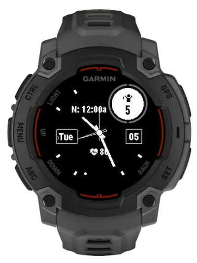

# garmin-analog-watchface

Modified from <https://github.com/bhugh/ElegantAnalog-Watchface/>

Features from upstream that are enabled by default:

- Sunrise/sunset time (as hour hashes)
- Date/day of week on `3` and `9` position with rectangle border
- Hour hashes
- Seconds hand is disabled

Added features:

- Body battery on inset circle
- Second hour hand for alternate time zone (alternating color for day/night)
- Third hour hand for next calendar event
- Next calendar event display
- Heart rate display

## Screenshot

